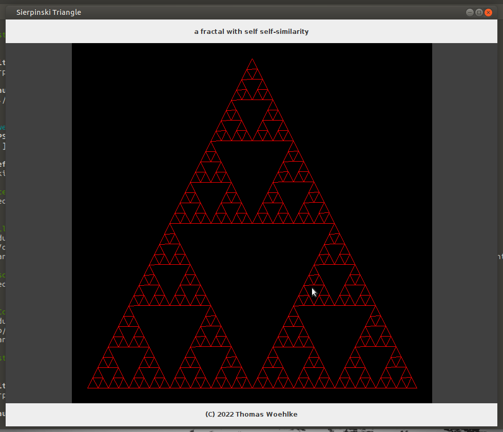

# Sierpinski triangle


**a fractal with self self-similarity**

## Abstract

The Sierpiński triangle (sometimes spelled Sierpinski),
also called the Sierpiński gasket or Sierpiński sieve, is a fractal attractive fixed set with the
overall shape of an equilateral triangle, subdivided recursively into smaller equilateral triangles.

Originally constructed as a curve, this is one of the basic examples of self-similar sets—that is,
it is a mathematically generated pattern that is reproducible at any magnification or reduction.

It is named after the Polish mathematician Wacław Sierpiński, but appeared as a decorative pattern
many centuries before the work of Sierpiński.


## Run the Desktop Application

```
git clone https://github.com/Computer-Kurzweil/sierpinski-triangle.git
cd sierpinski-triangle
./mvnw
```

## Screenshot




## Repositories
* [Github Repository](https://github.com/Computer-Kurzweil/sierpinskitriangle)
* [Maven Project Reports](https://java.woehlke.org/sierpinskitriangle/)
