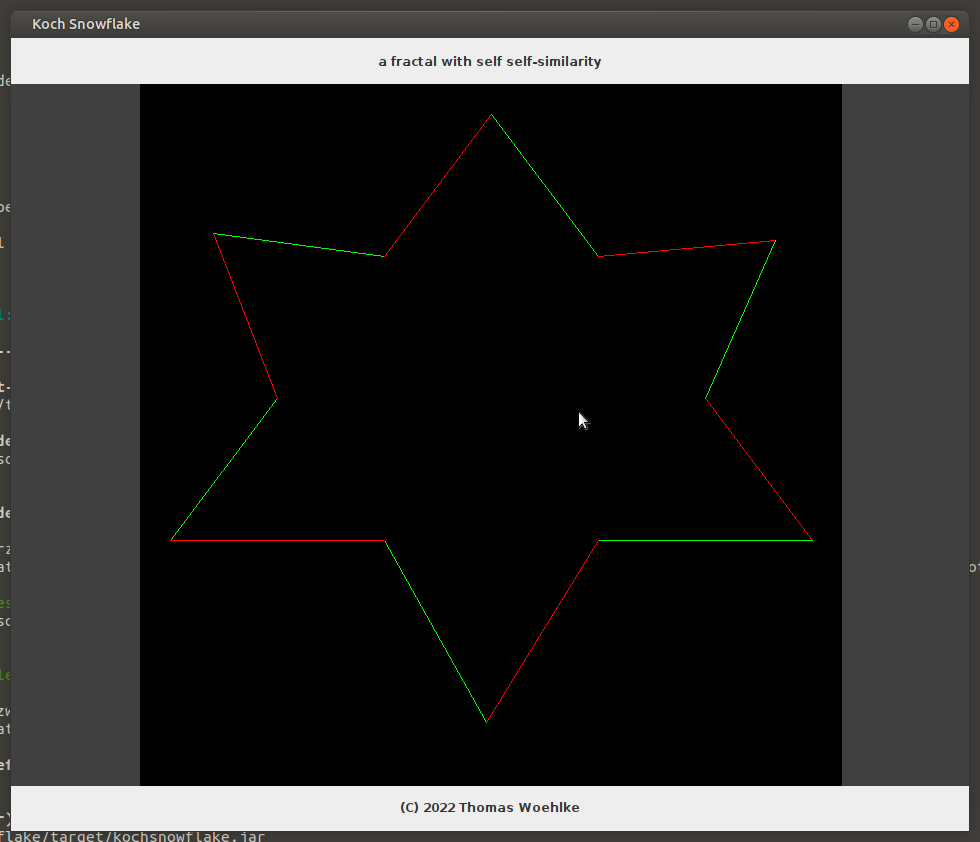
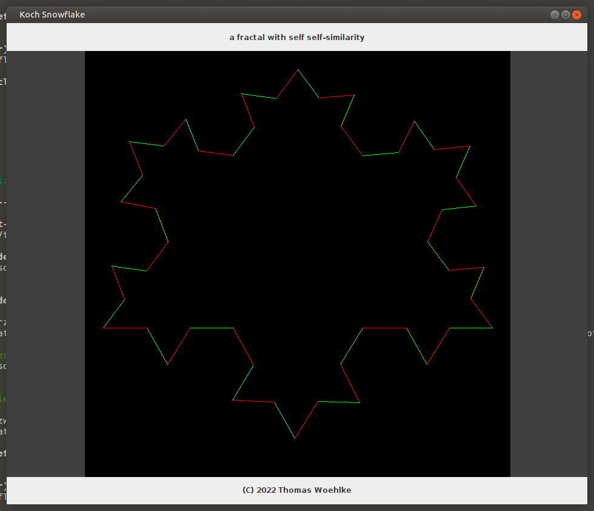
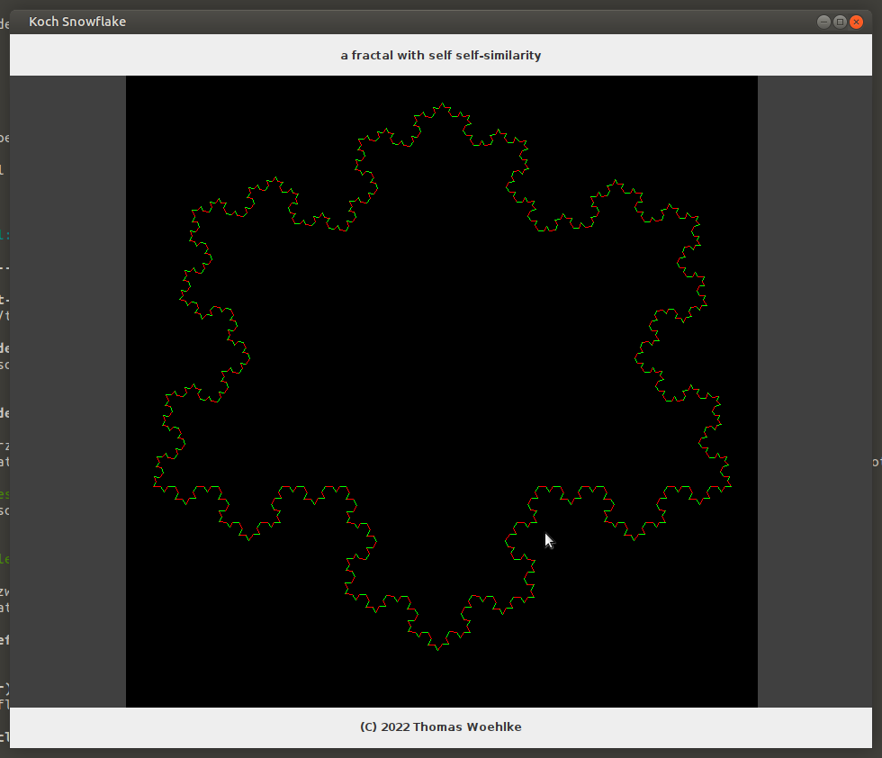

# Koch snowflake

[](https://github.com/Computer-Kurzweil/kochsnowflake/actions/workflows/maven.yml)

**a fractal with self-similarity**

## Abstract: Koch snowflake

The Koch snowflake (also known as the Koch curve, Koch star, or Koch island)
is a fractal curve and one of the earliest fractals to have been described.

It is based on the Koch curve, which appeared in a 1904 paper titled
"On a Continuous Curve Without Tangents, Constructible from Elementary Geometry"
by the Swedish mathematician Helge von Koch.

The Koch snowflake can be built up iteratively, in a sequence of stages.
The first stage is an equilateral triangle,
and each successive stage is formed by adding outward bends to each side of the previous stage,
making smaller equilateral triangles.

The areas enclosed by the successive stages in the construction
of the snowflake converge to 8 5 {\displaystyle {\tfrac {8}{5}}} times the area of the original triangle,
while the perimeters of the successive stages increase without bound. Consequently, the snowflake encloses
a finite area, but has an infinite perimeter.

## More
* [https://en.wikipedia.org/wiki/Koch_snowflake](https://en.wikipedia.org/wiki/Koch_snowflake)
* [https://en.wikipedia.org/wiki/Helge_von_Koch](https://en.wikipedia.org/wiki/Helge_von_Koch)

## Screenshots

### first stage is an equilateral triangle



### each successive stage is formed by adding outward bends to each side of the previous stage



### each successive stage is formed by adding outward bends to each side of the previous stage




### Repositories
* [Github Repository](https://github.com/Computer-Kurzweil/kochsnowflake)
* [Maven Project Reports](https://java.woehlke.org/kochsnowflake)

### Run the Application
```
git clone https://github.com/Computer-Kurzweil/kochsnowflake.git
cd kochsnowflake
./mvnw
```
